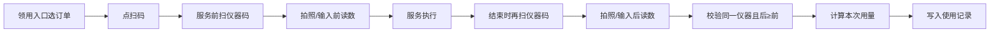

# 医美仪器管理 - 新增场景与功能梳理

## 一、概述

- **背景**：在现有门诊库存管理（产品管理、入库/出库/调库、库存盘点、开用盘点、产品开用、产品领用）基础上，新增「医美仪器」这一资产类型的管理与使用追踪。
- **仪器特性**：
  - 类型：**发数**（按次数/发数消耗）、**片数**（按片/张数消耗）。
  - 机器有**有效期**，需在管理流程中体现（如入库、盘点、预警）。
- **涉及角色**：库管、技师。

---

## 二、角色与功能总览

| 角色  | 功能编号 | 功能名称     | 类型     | 说明                           |
| --- | ---- | -------- | ------ | ---------------------------- |
| 库管  | 1    | 产品管理     | 现有     | 录入门诊产品基础信息                   |
| 库管  | 2    | 入库、出库、调库 | 现有+增强  | 录入各门店库存；**增强**：仪器出库增加「返厂维修」  |
| 库管  | 3    | 库存盘点     | 现有     | 盘点剩余库存数量                     |
| 库管  | 4    | 开用盘点     | 现有     | 盘点开用后产品余量                    |
| 库管  | 7    | 仪器管理     | **新增** | 仪器基础信息、类型（发数/片数）、有效期、唯一二维码等  |
| 技师  | 5    | 产品开用     | 现有     | 扫码领用出库，商品为开用状态，生成余量二维码       |
| 技师  | 6    | 产品领用     | 现有     | 扫余量二维码领取用量，扣除余量              |
| 技师  | 8    | 仪器用次登记   | **新增** | 服务前后扫仪器二维码、拍照/录入读数，按订单统计使用数据 |

---

## 三、新增场景详解

### 3.1 库管 - 仪器管理（新功能 7）

- **场景**：库管需要像「产品管理」一样，维护医美仪器的档案与在店状态。
- **要点**：
  - 录入仪器基础信息（名称、型号、所属门店、类型、有效期等）。
  - 仪器类型：**发数** / **片数**（决定后续「用量」单位：次 vs 片）。
  - 有效期管理：支持录入、展示，并可后续扩展「临期/过期」提醒或拦截。
  - **唯一识别二维码**：仪器入库到各门店时，由**现有入库流程（老流程）**在最后环节产生/绑定该仪器的唯一二维码，用于后续服务前/后扫码，确保拍照记录的是同一台仪器。
  - **返厂再入库**：沿用同一二维码，不重新生成；若仪器不能再使用，通过**报废标识**处理，不换码。
  - 与现有「入库、出库、调库」的关系：仪器可视为一种特殊「资产」，入库时绑定类型、有效期及唯一二维码；出库时增加「返厂维修」类型。**返厂维修期间仪器在系统中置为不可用**，不可被选或扫到。

### 3.2 库管 - 出库增强：返厂维修（功能 2 增强）

- **场景**：仪器需要送修或返厂时，从门店「出库」，修好后再「入库」或调库回店。
- **要点**：
  - 出库类型增加：**返厂维修**（与销售、调拨、报损等并列）。
  - 可选：记录送修时间、预计归还、维修单号等，便于追踪在修仪器。

### 3.3 技师 - 仪器用次登记（新功能 8）

- **场景**：服务医美项目时，需按「仪器」维度追踪使用次数/片数，并与服务订单绑定。为识别每次服务拍照的是同一台仪器，流程中需在服务前、结束时分别扫描该仪器在**入库时绑定的唯一识别二维码**，再拍照/录入读数。与现有产品领用一致：**先开单**，在**领用功能**中显示服务订单，订单上有**扫码按钮**；项目与仪器暂无强关联，可**按实际使用随意扫码**（后续是否按项目预设用量强校验待优化）。
- **流程（已确认）**：
  1. 找到服务订单，点击**扫码**按钮。
  2. **服务前**：扫仪器唯一二维码 → 拍照仪器显示屏（或手动输入）→ 通过**图片识别**读取数字或**手动输入**「开始前」读数，系统记录服务前读数并关联该仪器。
  3. 服务执行。
  4. **结束时**：再次扫同一仪器唯一二维码 → 拍照或手动输入「结束后」读数。
  5. 系统校验前后两次扫码为同一仪器；**若服务后读数 < 服务前读数则报错提醒，不允许通过**；否则计算：本次使用量 = 服务后读数 − 服务前读数，写入使用记录。
  6. 按订单、仪器维度统计使用数据。
- **订单与记录关系**：仪器使用记录与订单状态独立，**订单取消不影响已产生的仪器使用记录**（用过了即保留）。
- **开单所选与扫码一致性**：当前流程**允许**开单选的仪器与实际扫码不一致；后续是否改为「按项目/标准必须扫对应仪器」待优化确认。
- **与现有 5、6 的对比**：产品领用为扫产品/余量二维码扣用量，项目与产品无强关联；仪器用次登记为**扫仪器唯一二维码 + 拍照/输入前后读数**，保证用次与仪器一一对应。

---

## 四、功能命名建议（功能 8）

- **推荐命名**：**仪器用次登记**（突出「登记用次」、与一次服务绑定）。
- 备选：仪器服务登记、仪器使用记录。

---

## 五、涉及功能清单（按场景汇总）

- **仅库管**：仪器管理（7）、出库-返厂维修（2 增强）；库存/开用盘点（3、4）若包含仪器则需约定是否展示「发数/片数」及有效期。
- **仅技师**：仪器用次登记（8）、产品开用（5）、产品领用（6）。
- **跨角色**：入库/出库/调库（2）— 库管操作，仪器作为资产参与；仪器使用数据统计 — 依赖技师登记（8），库管或运营可查看报表。

---

## 六、数据与流程示意

### 6.1 数据

- **仪器主数据**：仪器 ID、名称、型号、类型（发数/片数）、有效期、所属门店、当前状态（在店/返厂维修等）、**入库时绑定的唯一识别二维码**（与仪器 ID 一一对应）。
- **仪器使用记录**：订单 ID、仪器 ID、服务前读数、服务后读数、本次使用量、操作人、时间（前后两次均通过扫该仪器唯一二维码确定仪器 ID）。

### 6.2 场景流程（仪器用次登记）

领用入口 → 选服务订单 → 点扫码 → **服务前**：扫仪器唯一二维码 → 拍照/手动输入服务前读数 → 服务执行 → **结束时**：再扫同一仪器唯一二维码 → 拍照/手动输入服务后读数 → 校验同一仪器且后≥前，否则报错 → 计算本次用量 → 写入使用记录。

### 6.3 流程图

---

## 七、与现有模块的关系说明

- **产品管理（1）**：产品与仪器可分开建模；若系统希望统一「资产」入口。
- **入库/出库/调库（2）**：仪器入库时必填类型与有效期，并由现有入库流程在最后环节生成/绑定该仪器的**唯一识别二维码**；出库增加「返厂维修」流程；返厂维修期间仪器置为不可用。
- **库存盘点（3）/ 开用盘点（4）**：若盘点范围包含仪器，需支持按「发数/片数」盘点当前读数或状态，并与仪器档案、有效期一起展示。
- **产品开用（5）/ 产品领用（6）**：逻辑不变；与仪器用次登记（8）并行，一个管「商品余量」，一个管「仪器用次/片数」。

---

## 八、已确认规则（问答沉淀）

- **唯一二维码**：仪器入库到各门店时由现有入库流程最后产生；返厂再入库沿用同一码；不能用的用报废标识，不换码。
- **读数**：支持拍照后图片识别数字或手动输入；**服务后读数须 ≥ 服务前**，否则报错不允许通过。
- **订单取消**：不影响已产生的仪器使用记录。
- **返厂维修**：该状态下仪器置为不可用，不可被选/扫。
- **开单与扫码**：当前允许所选仪器与扫码不一致，后续是否按标准强校验待定。

---

## 九、待确认项

- **多台仪器**：一次服务多台仪器时，每台是否必须完整「扫→拍前→扫→拍后」、漏扫或顺序错是否校验（待确认）。
- **有效期**：到期后是否禁止使用或仅预警（待确认）。
- **仪器随团队跨店流转**：部分医美仪器跟随医美团队在各门店间转换；简版方案为**按服务订单找该仪器上次服务的门店，作为当前所在门店**（待确认）；归属/调拨、与「所属门店」字段兼容方式待定。
- **项目预设用量**：线下希望按项目预设每次服务用量、扫码后按标准扣，但存在没货/同功效可替换等限制，是否以及如何做强关联待后续优化。

---

## 十、待沟通项（与门店实际运营人员确认后记录）

- **谁可录入/修改读数**：仅技师本人或允许代录、店长/库管是否可改；是否留操作人。
- **先扫码后补录**：是否允许先扫码、后补拍/补录读数；若允许，时间或次数限制。

