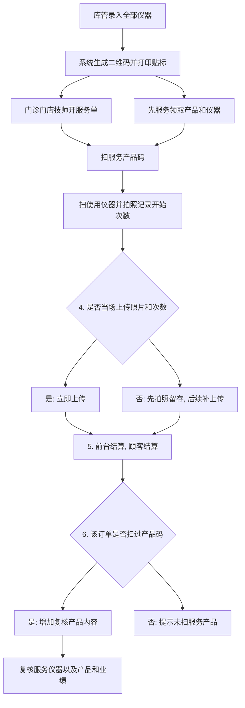

# 仪器管理需求确认文档

## 1. 整体目标、价值、使用人群、大致场景

### 1.1 整体目标

- 资产部门成本控制：通过仪器全链路数据实现监控与追溯，支撑成本优化与资产调配决策。
- 业务部门能力提升：通过服务单沉淀仪器使用次数与记录，提升技师操作规范和业务水平。

### 1.2 功能价值

- 资产价值（成本控制）：仪器全生命周期可追溯（在店、返厂、自动门店归属变更、停用/报废），减少闲置与重复投入。
- 业务价值（能力提升）：服务单级别记录仪器使用过程与结果，帮助技师复盘并持续优化操作。
- 管理价值（监控稽核）：通过“正常/人工修正/异常拦截”识别异常使用，支撑质控复盘与责任追踪。

### 1.3 使用人群

- 资产部门（核心）：库管、资产管理相关角色
- 业务部门（核心）：技师、治疗师及门店业务管理角色
- 管理查看：店长/运营

### 1.4 大致场景

- 仪器新增与档案维护
- 二维码生成/打印/补打
- 单机使用追踪与异常定位
- 通过最新有效订单自动识别仪器当前门店归属

### 1.5 版本边界（本次确认会）

- 本次确认范围（V1）：列表、添加、二维码、使用记录、门店归属变更记录（自动）。
- 非本次范围（V2+）：经营ROI深度模型、项目强校验、跨系统自动对账告警。

---

## 2. 按大致流程拆分

### 2.0 主流程图（门店服务与复核）

### 2.1 流程1：库管创建仪器，打印二维码，贴到仪器

- 参与角色：库管
- 对应模块：添加仪器、二维码弹窗
- 流程：
  1. 创建仪器主档（类型、初始值、平均使用区间、有效期等）。
  2. 保存后系统自动生成二维码编码。
  3. 执行“生成并打印二维码”，将二维码贴到仪器。
- 场景价值：
  - 资产建档标准化。
  - 减少手工录码错误。

### 2.2 流程2：仪器跟随业务到各门店（自动归属）

- 参与角色：系统自动处理（业务触发），资产部门查看
- 对应模块：门店归属变更记录（自动）
- 流程：
  1. 仪器产生新的有效服务订单并绑定门店。
  2. 系统识别“最新有效订单”对应门店，自动更新仪器当前归属门店。
  3. 系统写入归属变更记录（原门店 -> 新门店、触发订单、触发时间）。
- 场景价值：
  - 取消人工归属变更操作，减少人为维护成本。
  - 保证门店归属与真实业务发生地一致。

### 2.3 流程3：技师通过服务单选择使用的仪器和服务产品

- 参与角色：技师
- 对应模块：B端服务单（仪器选择）
- 流程：
  1. 在服务单中选择使用仪器（或按实际扫码仪器登记）。
  2. 支持并列场景：先服务领取产品和仪器，后补录/关联服务单。
  3. 系统建立“服务单-仪器”使用关系。
- 场景价值：
  - 沉淀业务数据来源。
  - 支撑后续能力评估与复盘。

### 2.4 流程4：技师服务开始前扫仪器码，结束后扫仪器码

- 参与角色：技师
- 对应模块：B端扫码领用流程（仅仪器，不含产品）
- 流程：
  1. 服务前扫码并录入服务前读数（拍照/OCR或手动）。
  2. 服务后扫码并录入服务后读数。
  3. 系统校验并计算本次使用量后写入记录。
- 校验口径：
  - 同一仪器校验；
  - 服务后读数 >= 服务前读数；
  - 校验结果：正常 / 人工修正 / 异常拦截。
- 场景价值：
  - 提高一线执行规范。
  - 异常可识别、可追责。

### 2.5 流程5：运营人员通过数据查看仪器数据

- 参与角色：运营、店长
- 对应模块：使用记录、门店归属变更记录、仪器管理列表
- 流程：
  1. 查看单机汇总与明细（使用次数、用量、异常情况）。
  2. 查看自动门店归属变更历史与触发订单。
  3. 识别问题并推动门店优化。
- 场景价值：
  - 支撑运营决策与质控复盘。
  - 提升设备利用效率。

### 2.6 流程6：财产本部看数据

- 参与角色：财产本部/资产部门
- 对应模块：仪器管理列表、门店归属变更记录、使用记录（管理视角）
- 流程：
  1. 查看资产状态分布（在店/返厂/未启用/报废）。
  2. 查看自动归属变更效率和设备利用水平。
  3. 形成成本控制与资产调配决策。
- 场景价值：
  - 实现资产成本可控。
  - 减少闲置与重复配置。

---

## 3. 讨论记录（结论 + 被否方案 + 取舍理由）

### 3.1 二维码创建时机

- 最终结论：创建时不操作二维码；保存后系统自动生成并支持打印。
- 被否方案：创建时手动扫码/录入二维码。
- 取舍理由：降低创建复杂度，减少人工错误。
- 影响模块：添加仪器、二维码弹窗。

### 3.2 二维码页面分流方式

- 最终结论：系统自动判断进入未打印页/已打印页。
- 被否方案：用户手动选择打印状态。
- 取舍理由：减少误操作，流程更贴合实际。
- 影响模块：二维码弹窗。

### 3.3 未打印页展示逻辑

- 最终结论：未打印页不展示二维码图片和下载按钮。
- 被否方案：未打印状态也展示二维码图。
- 取舍理由：避免“未打印却可下载”的认知冲突。
- 影响模块：二维码弹窗。

### 3.4 列表操作区形态

- 最终结论：查看/编辑直出，其他动作放“更多”菜单。
- 被否方案：所有动作平铺在列表行内。
- 取舍理由：节省空间，同时保留高频效率。
- 影响模块：列表页。

### 3.5 状态动作映射

- 最终结论：在店显示“停用”；返厂/报废/未启用显示“启用”。
- 被否方案：所有状态统一显示“停用”。
- 取舍理由：动作方向与状态语义一致。
- 影响模块：列表页。

### 3.6 使用记录字段口径

- 最终结论：保留校验结果并统一为“正常/人工修正/异常拦截”。
- 被否方案：不展示校验结果，仅展示读数。
- 取舍理由：满足质控复盘与风险定位。
- 影响模块：使用记录页。

### 3.7 仪器归属门店变更方式

- 最终结论：删除手动调整仪器归属门店的操作与流程；改为系统按最新有效订单自动变更门店归属。
- 被否方案：通过人工发起并确认流程后再更新门店归属。
- 取舍理由：减少人工维护和漏改风险，使门店归属与业务真实发生地一致。
- 影响模块：列表页门店展示、门店归属变更记录。

---

## 4. 待确认项（会中逐条拍板）

- 报废状态是否允许补打二维码（建议：不允许）。
- 启用后默认回到“在店”还是“未启用待分配”。
- 人工修正按钮点开后的详情字段范围与权限。
- 最新有效订单的判定规则（状态、时间、是否排除取消单）。
- 是否纳入财务人员：
  - 讨论点：财务是否需要直接进入本页面查看，还是通过运营/资产部门输出报表接收数据。
  - 建议：V1不开放财务直接操作，仅开放报表结果；V2按管理要求评估只读权限。

### 4.1 待讨论场景：团队跟随机制（仪器随团队走）

- 场景描述：部分门诊仪器不固定挂在单一门店，而是跟随人员团队跨店服务；团队在哪个门店，仪器显示在哪个门店。
- 拟定流程：
  1. 团队排班或服务单明确当前服务门店。
  2. 系统识别该仪器为“团队跟随机器”后，自动将当前所在门店更新为团队所在门店。
  3. 列表页展示门店时，优先显示“当前所在门店（随团队）”。
  4. 若团队跨店切换，门店归属随下一次有效业务事件（排班变更/服务单开始）同步更新。
- 建议字段口径：
  - 是否团队跟随（是/否）；
  - 所属门店（资产归属）与当前所在门店（运营位置）分离。
- 需拍板问题：
  - 触发事件以“排班变更”还是“服务单开始”为准；
  - 同时跨店冲突时的优先级；
  - 是否允许极少数异常场景下的后台纠偏（仅系统管理员）。

---

## 5. 验收标准（会后对齐）

- 整体目标与六步流程可被各角色共同理解并认同。
- 每一步都有明确角色、模块、价值与边界。
- 关键规则口径一致，可直接映射到页面和研发实现。
- 讨论记录可追溯“结论-被否方案-取舍理由”。

