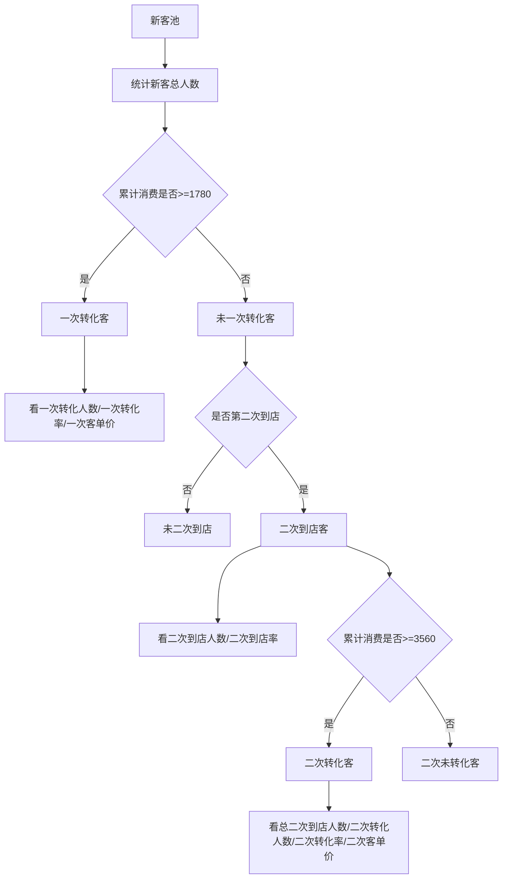

# 运营首页 — 信息架构与经营指标

面向 **运营主管** 的「运营管理驾驶舱」首页；目标为 **数据总览**，优先 **经营类指标**。

## 信息层级（P0 / P1 / P2）

| 优先级 | 模块 | 用户问题 | 默认展示 |
|--------|------|----------|----------|
| **P0** | 全局筛选 | 我在看什么范围的数据？ | 时间：今日（可切 7 天 / 30 天）；业务线、区域占位 |
| **P0** | 核心经营 KPI | 经营健康度一眼如何？ | 营收、客单价、ROI + 环比变化 |
| **P1** | 趋势与结构 | 变化来自哪里？ | 营收趋势简图；渠道/来源贡献 Top |
| **P1** | 异常与风险 | 现在最需要管什么？ | 预警列表（级别、影响、时间） |
| **P2** | 待办与动作 | 我要推动谁做什么？ | 待审批、待跟进、快捷入口占位 |

## 经营类核心指标 — 口径与排序

默认排序（左→右、上→下）：**营收 → 客单价 → ROI**。

| 指标 | 建议口径（可随业务替换） | 对比维度 |
|------|--------------------------|----------|
| **营收（GMV）** | 选定时间范围内的订单总金额（或已结算金额，需与财务一致） | 环比上一同等长度周期；可选同比 |
| **客单价（AOV）** | 营收 ÷ 有效订单数 | 同上 |
| **ROI** | （营收 − 投放/补贴等成本）/ 成本；若无成本数据则展示「投放 ROI」占位 | 同上 |

时间切换逻辑：

- **今日**：偏实时运营与当日目标达成。
- **近 7 天**：看短期波动与周节奏。
- **近 30 天**：看经营趋势与结构性变化。

## 设计文件

- 画布实现：`设计/运营首页.pen`
- 视觉：`mobile-03-swissclean_light`（白底、1.5px 描边容器、#2563EB 强调）

## 设计稿落地

- 顶层画板：`latBJ`（名称「运营首页」，宽 402px，垂直堆叠模块）
- 模块顺序：顶栏与通知 → 时间筛选（今日/7 天/30 天）→ 业务线/区域筛选 → 核心经营 KPI（营收 / 客单价 / ROI）→ 营收趋势示意 → 渠道贡献 Top3 → 异常与风险 → 待办与动作 → 底部导航（首页 / 数据 / 我的）
- 图标：Lucide；底栏图标使用 `layout-dashboard`、`chart-column`、`circle-user`（避免无效 icon 名称）

## 客户转化流程图

口径：
- 一次转化：新客累计消费到店金额 `>=1780`
- 二次转化：第二次到店后累计消费到店金额 `>=3560`

